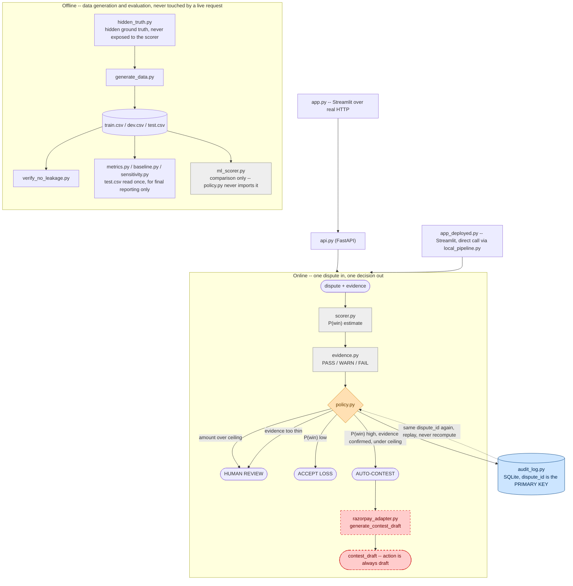

# Architecture

Two separate paths through this codebase: an **offline** path that builds
and evaluates the system against a held-out set, and an **online** path
that scores one real dispute and returns one decision. Nothing in the
online path ever calls back into the offline path — evaluation never
influences a live decision.

Colors below aren't decorative: they mirror the trust-boundary table in
`README.md`. Orange = safety-critical and unconditional. Red dashed = can
never cross into a real action on its own. Grey = advisory only, never
acts. Blue = durable record.

## Reading this diagram

- **Offline never feeds a live decision.** `test.csv` is read by the
  evaluation modules to report honest numbers after the fact; it isn't
  read by `scorer.py`/`policy.py` at request time. `ml_scorer.py` is
  trained and measured for comparison and is never imported by
  `policy.py`.
- **`scorer.py` and `evidence.py` are advisory (grey).** They only ever
  produce a number and a packet — neither can take an action.
- **`policy.py` is the only place a routing decision is made (orange),**
  and the two safety checks inside it (monetary ceiling, evidence
  completeness) are unconditional — they run before `win_probability` is
  even read, not as an extra condition that a confident score could talk
  its way past.
- **`razorpay_adapter.py`'s draft output is structurally blocked from
  becoming a real submission (red, dashed).** The function the pipeline
  calls, `generate_contest_draft()`, has no parameter that could ever ask
  for `action="submit"`.
- **`audit_log.py` is the one durable record (blue).** Every decision is
  written once; the same `dispute_id` coming in again returns the
  original decision instead of a fresh computation.
- **The two Streamlit apps reach the same online path two different
  ways** — `app.py` over real HTTP through `api.py`, `app_deployed.py` by
  calling the pipeline functions directly — and are tested against each
  other to make sure they never silently diverge (see
  `test_local_pipeline.py::test_matches_api_pipeline_exactly`).

If the diagram above doesn't render in your viewer, the same flow is
described in the ASCII version in `README.md`'s Architecture section.
