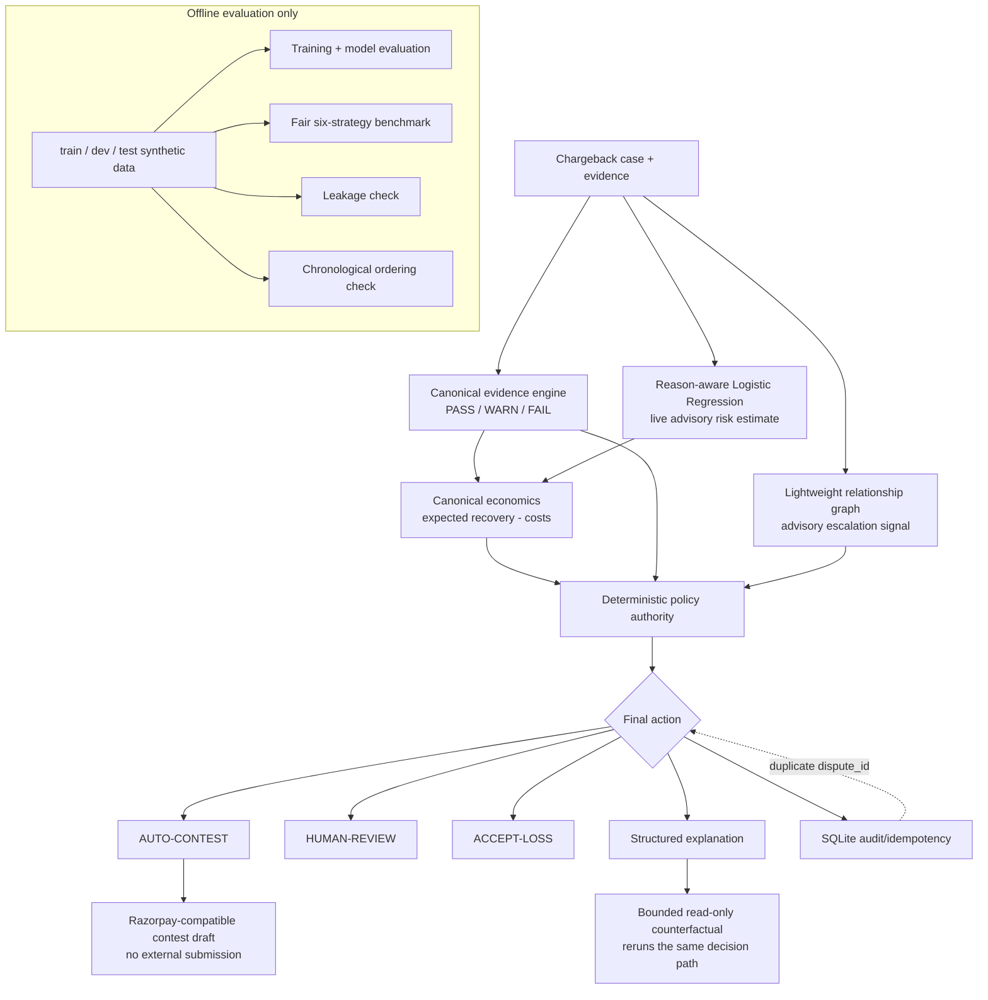

# Architecture

Chargeback Risk Engine keeps one decision path for the API, Streamlit UI, CLI demo, benchmark, and counterfactual analysis.



## Decision flow

1. The request is validated at the API boundary.
2. The evidence engine evaluates reason-relevant fields as `PASS`, `WARN`, or `FAIL`.
3. The live model estimates contest-win likelihood. This estimate is advisory.
4. The relationship graph supplies supporting risk context. It is advisory.
5. The economics module computes expected recovery and expected net value from the case amount and live risk estimate.
6. The policy module applies safety and business gates in fixed order.
7. The engine returns one of `AUTO-CONTEST`, `HUMAN-REVIEW`, or `ACCEPT-LOSS`.
8. A contest draft is generated only for `AUTO-CONTEST`.
9. The explanation records why the decision occurred and what the bounded counterfactual search found.
10. The result is persisted by `dispute_id`; duplicate requests replay the original decision.

## Single canonical path

The authoritative entry point is:

```python
from chargeback_risk_engine.engine.hybrid_pipeline import decide_case
result = decide_case(dispute)
```

The module name is retained because it is the canonical public entry point; the live risk estimate is the Logistic Regression model.

The following all call `decide_case(...)`:

- FastAPI `/decision`
- Streamlit `apps/app_deployed.py`
- `scripts/demo.py`
- `scripts/benchmark.py`
- `chargeback_risk_engine.metrics.run_pipeline`
- `engine/counterfactual.py`

There is no second policy function for demos or UI rendering.

## Live model selection

The live risk estimator is the reason-aware Logistic Regression scorer in `ml_scorer.py`.

Current held-out model evidence:

| Model | PR-AUC | Brier | Calibration error |
|---|---:|---:|---:|
| Rules | 0.7093 | 0.2365 | 0.1246 |
| Logistic | **0.7234** | **0.2165** | **0.0075** |
| HGB challenger | 0.7038 | 0.2246 | 0.0741 |
| Offline hybrid challenger | 0.7210 | 0.2181 | 0.0209 |

The Logistic model wins on the most useful held-out quality/calibration measures while keeping a small live dependency surface. HGB and the hybrid remain for offline comparison only.

## Evidence

`evidence.py` is the canonical status engine. `engine/evidence_score.py` consumes its packet and adds evaluation metadata rather than maintaining another PASS/WARN/FAIL implementation.

`UNKNOWN` is represented as `WARN`. Missing evidence is uncertainty, not positive evidence. Invalid or contradictory evidence can block automatic contesting.

## Economics

`engine/economic_decision.py` contains the only expected-value calculation:

```text
expected_recovery = probability_estimate × recoverable_amount
expected_net_value = expected_recovery - contest_cost - operational_cost
```

The field is named `probability_of_success` in the economic object but is derived from the model estimate. The repository does not present modeled expected recovery as realized financial recovery.

The economics module exposes `economically_viable`; it does not return an action.

## Policy authority

`policy.py` is the only action authority. The meaningful safety order is:

1. input validity
2. monetary ceiling
3. evidence validity, contradiction and completeness
4. graph escalation
5. contest/retry limit
6. external-service availability
7. model confidence and risk thresholds
8. expected net value
9. human-review fallback

A high model estimate or caller-supplied economic value cannot override a safety gate. The policy recomputes the canonical economic value from the amount and model estimate.

A true majority is required for automatic contesting: exactly 50% confirmed evidence is not enough.

## Counterfactual

The counterfactual engine evaluates at most ten relevant fields, flipping one valid input at a time and rerunning `decide_case(...)`.

It is read-only with respect to production audit state. It uses a temporary SQLite database and never changes the model or policy configuration.

Possible outcomes are:

- `DECISION_CHANGED`
- `RISK_CHANGED_DECISION_UNCHANGED`
- `NO_CHANGE_FOUND`

A risk-score change without an action change is explicitly reported as **“Risk changed, decision unchanged.”**

## Audit and idempotency

The SQLite audit record is keyed by `dispute_id`. A repeated request returns the original stored decision rather than recomputing a different outcome from mutated input.

The audit record also stores model, feature, and policy versions.

## Offline evaluation boundaries

Offline data never participates in a live request. Training, leakage checks, benchmark calculations, and the chronological ordering check operate on the synthetic train/dev/test files and produce artifacts for reporting.

The chronological check is intentionally not advertised as temporal robustness because the dataset dates are synthetic.

## External integration boundary

`razorpay_adapter.py` creates a contest draft only. There is no production submission path in the demo or benchmark.

## Submission notes

The live application presents five deterministic demo cases: strong evidence, mixed evidence, graph escalation, weak evidence, and an economic boundary case. The evaluation dataset contains 20,000 training rows, 5,000 development rows, and 5,000 held-out test rows.

The main differentiator is the combination of `engine/risk_graph.py` for temporal connected-cluster context, `engine/economic_decision.py` for expected-value economics, and the bounded evidence analyst. One deterministic policy remains authoritative, and `tests/test_safety_regression.py` proves that the monetary ceiling cannot be bypassed by model confidence or a caller-supplied expected value.
